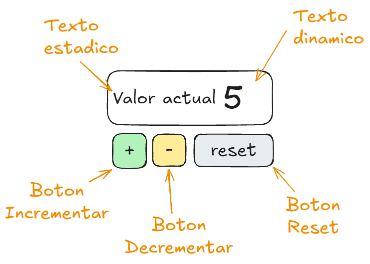
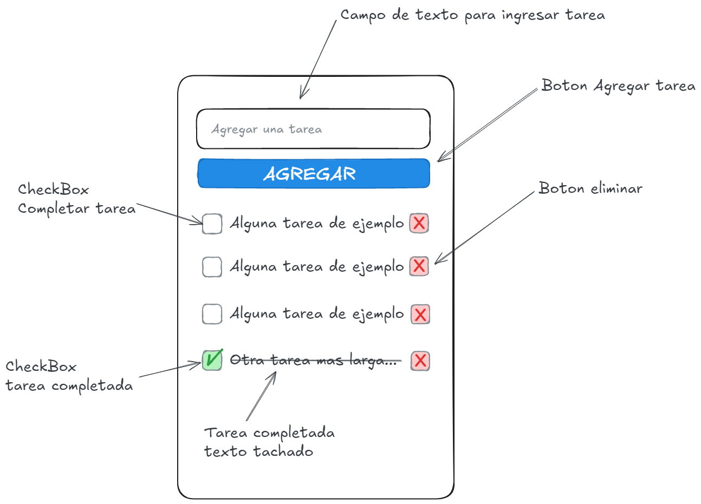
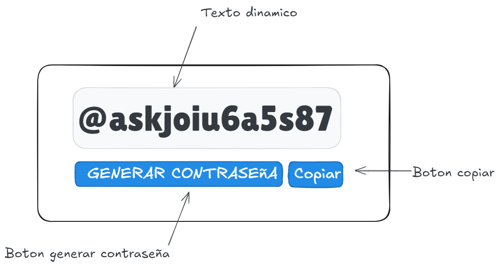

## Proyectos con HTML, CSS y JavaScript

### 1. **Contador de Clics**

Crea una página web simple con un botón que incremente un contador cada vez que se hace clic en él.

- **Descripcion**
  - El contador debe iniciar en cero, al iniciar la aplicacion.
  - Debera tener tres botones, Incrementar, Decrementar y Reiniciar
  - El boton incrementar aumenta el contador en una unidad
  - El boton decrementar reduce el contador en una unidad
  - El boton reiniciar establece el contador a cero
  - Evitar valores negativos
  - Si el valor del contador es cero, deshabilitar los botones Decrementar y Reiniciar

`Diagrama de ejemplo:`

### 2. **Lista de Tareas (To-Do List)**

Desarrolla una aplicación de lista de tareas donde los usuarios puedan agregar, marcar como completadas y eliminar tareas.

- **Descripción**
  - Al iniciar la aplicacion se debera mostrar la lista de tareas registras con sus respectivos estados.
  - Al crear una tarea, mostrar la misma al principio de la lista.
  - Cada elemento de la lista debera mostrarse con un checkBox para marcar la tarea como completada.
  - Cada elemento de la lista debera tener un boton que permita eliminar la misma, sin tomar en cuenta su estado.
  - Al marcar una tarea como completada debera cambiar la apariencia del checkbox y el texto tachado.
  - Al crear una tarea se debe validar el texto ingresado, evitar insertar tareas vacias.

`Diagrama de ejemplo:`

### 3. **Generador de Contraseñas Simple**

Diseñar una aplicación que genere contraseñas simples y aleatorias.

- **Descripción**
  - Tomar en cuenta simbolos, numeros, mayusculas y minusculas.
  - Longitud de 12 caracteres (opcional).
  - Boton para copiar la contraseña al portapapeles.
  - Boton para generar una nueva contraseña y actualizar el texto.
  - Al iniciar la aplicacion debera generar una contraseña nueva.

`Diagrama de ejemplo:`

